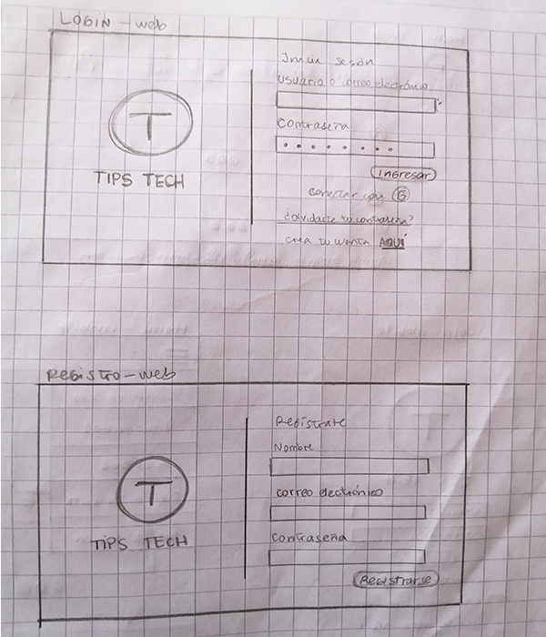
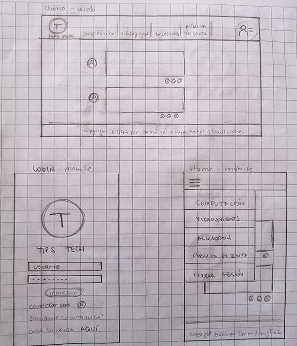
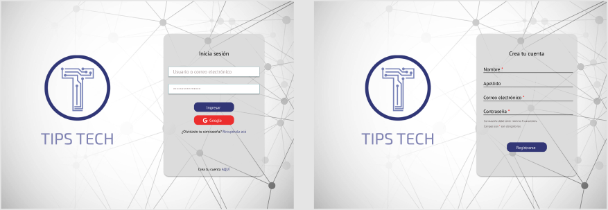
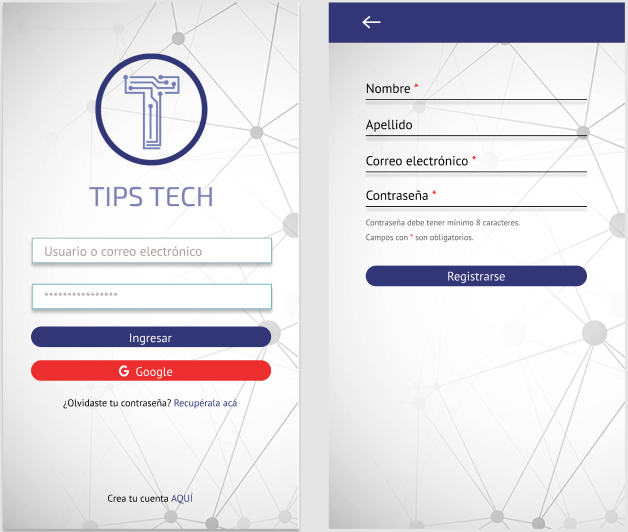
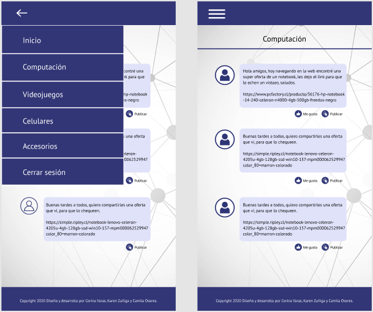

# TIPS TECH

Tips Tech es una red social en donde podrás encontrar y compartir tips de ofertas en productos tecnológicos que ofrece el mercado hoy en día a través de internet.

Para visitar la página [Haz click aquí]()

## Índice 

* [1. Introducción](##Introducción)
* [2. Definición del Producto](##Definición-del-Producto)
* [3. Planificación](##Planificación)
* [4. Definición de la interfaz de usuario](##Definición-de-la-interfaz-de-usuario)
* [5. Conclusión](##Conclusión)

## Introducción

Hoy en día debido al poco tiempo libre para buscar ofertas por la ciudad, es más común que los usuarios naveguen por internet y encuentren ofertas en el área de tecnología más rápido, pudiendo así comprar el producto que necesitan de manera inmediata y expedita directamente por la web.

## Definición del Producto

#### 1.Principales usuarios

Los usuarios principales de Tips Tech son personas que buscan de forma constante por internet, todo tipo de ofertas en tecnología como accesorios, computadores, videojuegos, etc.
Tienen entre 20 y 40 años de edad.

#### 2.Necesidades de los usuarios

Los usuarios hoy en día por distintos factores, como por ejemplo el tiempo libre de cada uno y el dinero que tienen para comprar productos de tecnología, cada vez están más interesados en encontrar precios convenientes a través de Internet para poder acceder a ofertas únicas, de una forma rápida, confiable y así ahorrar tiempo buscando de manera física los productos que le interesan.

#### 3.Propuesta

A raíz de la necesidad que hemos descubierto, es que nace la idea de crear una página web en la cuál los usuarios puedan acceder a crear un perfil en el que pueden compartir con otras personas todo tipo de oferta en productos tecnológicos como accesorios, computación, videojuegos, etc. Y así a su vez compartir datos donde pueden encontrar la mejor opción para cada uno, sin usar su tiempo libre recorriendo la ciudad buscando ofertas.

#### Historias de usuario

H.U. 1- Yo como usuario de TipsTech quiero crearme una cuenta para ingresar a la página web.

H.U. 2- Yo como usuario de TipsTech quiero loguearme para ingresar a la página.

H.U. 3- Yo como usuario de TipsTech quiero crear un post para publicar una oferta que quiero compartir con los usuarios.

H.U. 3- Yo como usuario de TipsTech quiero editar un post que publiqué en la página para corroborar la información.

H.U. 4- Yo como usuario de TipsTech quiero borrar un post para eliminar del muro una publicación que ya caducó.

H.U. 5- Yo como usuario de TipsTech quiero likear una publicación para demostrar que me gusta.

Es importante mencionar que para las historias de usuario establecidas anteriormente existen criterios de aceptación que se detallan en la planificación creada en trello, en donde puedes acceder más abajo.

## Planificación

La planificación de nuestra red social esta hecha en Trello.

Para acceder [Haz click aquí](https://trello.com/b/5MmBVhKp/red-social)

## Definición de la interfaz de usuario

### Prototipo de baja fidelidad

Sketch para web y mobile

Para ingresar a la plataforma Tips Tech debes loguearte como primer paso, si no tienes un usuario creado puedes acceder a la página con una cuenta Google, y si simplemente quieres crear una cuenta desde cero,en la siguiente interfaz puedes hacerlo.
Luego al ingresar a la página tienes opción de poder escoger la categoría que más te acomode de acuerdo a tus necesidades, para poder publicar o buscar tips de ofertas tecnológicas.

En primera instancia creamos las siguientes categorías: Computación, Videojuegos, Accesorios y publica tus ventas, pero al testear por primera vez nos dimos cuenta que olvidamos poner una de las más requeridas por los usuarios que es celulares, así iteramos en el prototipo y quedó: Computación, Videojuegos, Celulares y Accesorios.

### Prototipo de alta fidelidad

Wireframe web

Wireframe mobile

El prototipo de alta fidelidad está creado en Figma. En los siguientes enlaces puedes ver su funcionamiento.

[Prototipo web](https://www.figma.com/proto/sAK3FXb7qdnNlQzb8whgww/Tips-tech-web?node-id=5%3A2&scaling=scale-down)

[Prototipo mobile](https://www.figma.com/proto/ukCrXNdipeTM81s8LWovGJ/Tips-Tech-mobile?node-id=1%3A2&scaling=scale-down)

### Conclusión

Para concluir con nuestro proyecto destacamos el gran trabajo en equipo que se realizó durante estas 3 semanas, cumpliendo la mayoria de los objetivos planteados.

## Integrantes

* [Corina Varas](https://github.com/CorinaVaras)
* [Karen Zuñiga](https://github.com/kaarenzu)
* [Camila Osores](https://github.com/camila-osores)